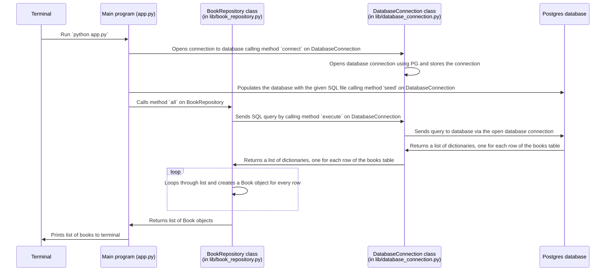

```python
# Table name: books

# Model class
# (in lib/book.py)
class Book
    def __init__(self, id, title, author):
        self.id = id
        self.title = title
        self.author = author

# Repository class
# (in lib/book_repository.py)
class BookRepository
    # Selecting all records
    # No arguments
    def all():
        # Executes the SQL query:
        # SELECT * FROM books;
        # Returns an array of Book objects.

        # Gets a single record by its ID
        # One argument: the id (number)
    def find(book_id):
        # Executes the SQL query:
        # SELECT * FROM books WHERE id = %s;
        # Returns a single Book object.

    # Creates single record of Book
    # One argument: Book object
    def create(book):
        # Executes the SQL query:
        # INSERT INTO books (title, author) VALUES (%s, %s)
        # Returns a single Book object.

    # Updates a single record of Book
    # One argument: id
    def update(col_name, new_value, book_id)
        # Executes the SQL query:
        # UPDATE books SET %s = %s  WHERE id = %s;
        # Returns a single Book object.

    # Destroys a single record of Book
    # One argument: id
    def delete(book_id)
        # Executes the SQL query:
        # DELETE FROM books WHERE id = %s;
        # Returns a single Book object.

```


